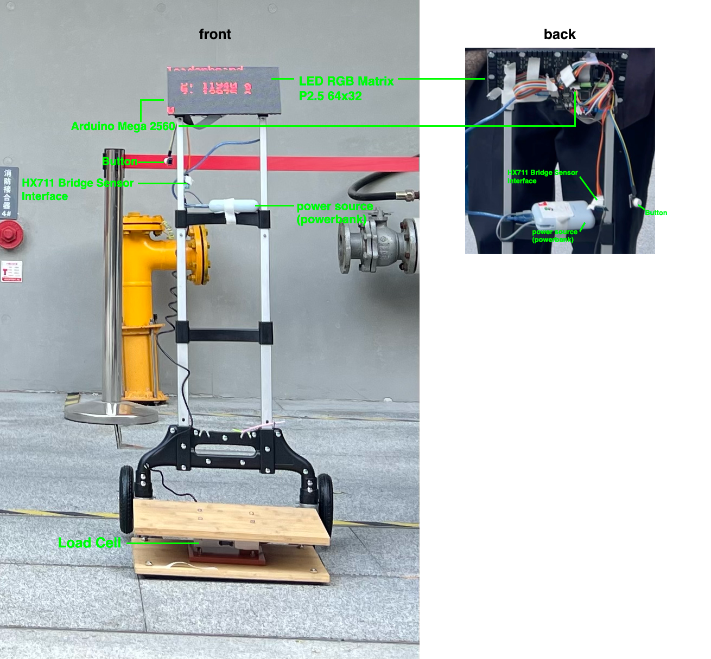
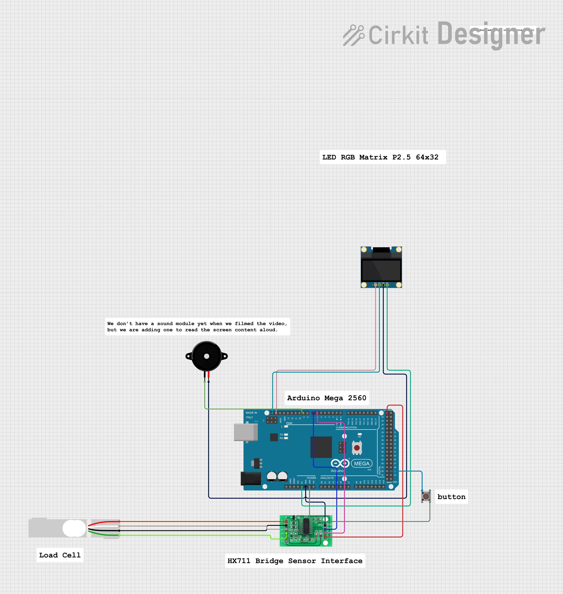
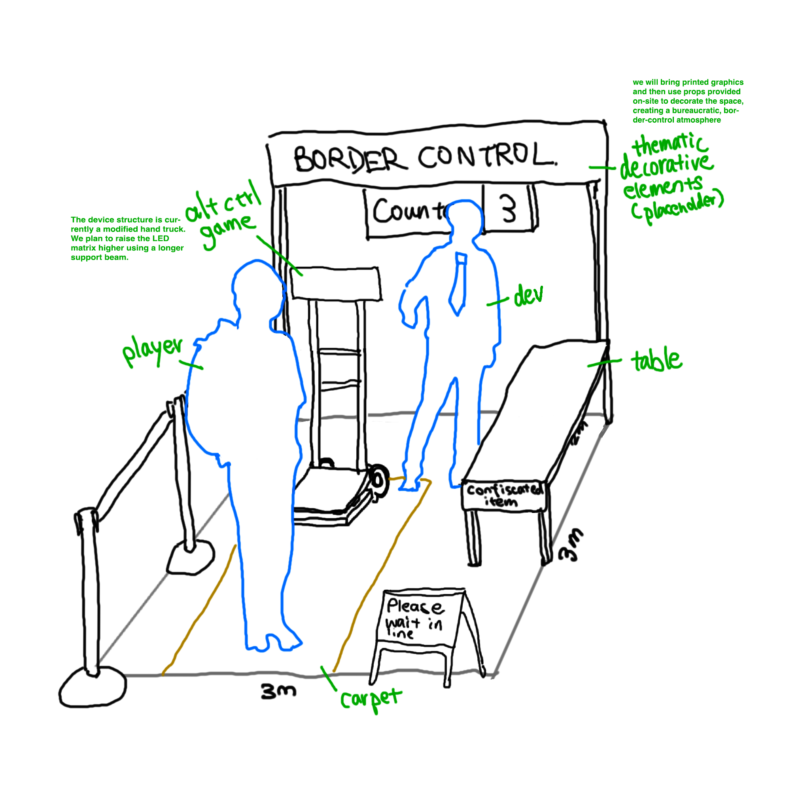
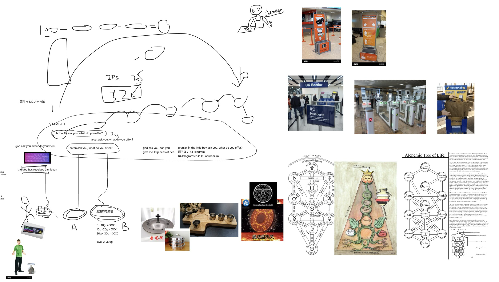
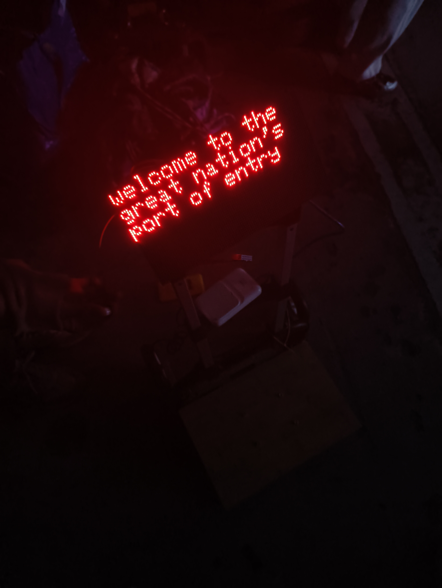

# Border Control

## Game Description

An absurdly strict border checkpoint where you enter as an unwanted alien. You step onto a custom load cell with all your belongings. An RGB LED panel lists ridiculous “prohibited items” one by one and tells you to discard objects of the same weight. The demands get stranger. You discard things until the system lets you pass.

## Details

[Video](https://youtu.be/AXJG8c4K-tI)

The game uses a custom load cell with an HX711 bridge sensor, an Arduino Mega 2560, and a P2.5 RGB LED matrix for display to create a physical and absurdly playful border weighing-checkpoint experience. Players have to plan and carry real objects onto the sensor and discard items to match arbitrary weights. The system runs entirely on the Arduino with a 64x32 LED matrix panel simulating the airport display. The interaction cannot be replicated with a standard controller. Gameplay relies on physically sensing, calculating, and negotiating weight, turning a bureaucratic, capitalistic procedures and demands into a playful experience with a twist of dark humour. Every play-through is different depending on what objects the player plans bring. The combination of custom hardware and game mechanics creates engagement that is tangible, challenging, funny, and entertaining in a way digital controls alone cannot capture.

Early sketch & inspiration

Other photos during playtest

## Team

[Joanna Lyu](https://joannalyu.com/) - game design/assembly

Tianqi Zhang - programming/design

Yuemin Huang - assembly

Special Thanks: Jonathan @GEA, Fay Li
---

*Last updated: 2025 Nov*

